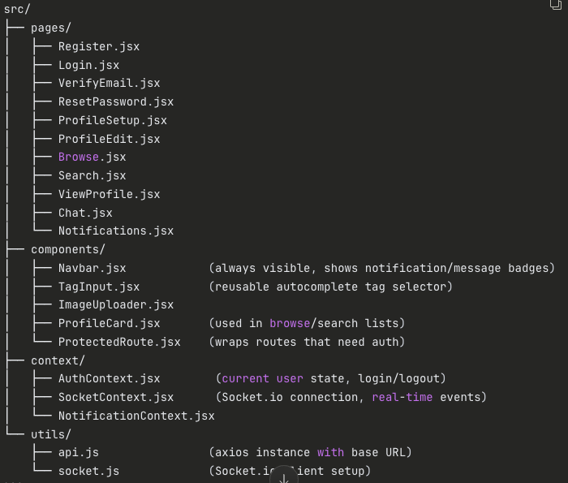
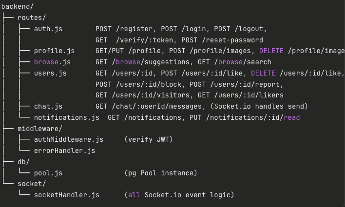
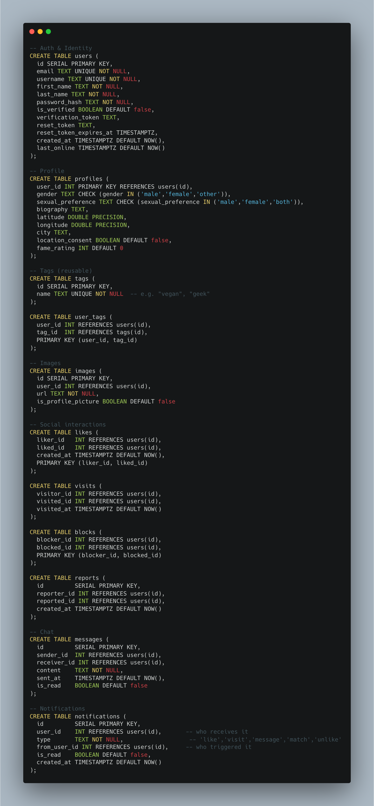

# 💕 Dating Site

> A full-stack dating application built with React, Node.js, Express, and PostgreSQL featuring real-time chat, advanced matching algorithms, and comprehensive user profiles.

## 📋 Table of Contents

- [Tech Stack](#-tech-stack)
- [Architecture](#-architecture)
- [Development Phases](#-development-phases)
  - [Phase 1 - Project Setup & Auth](#phase-1---project-setup--auth)
  - [Phase 2 - Database Schema Design](#phase-2---database-schema-design)
  - [Phase 3 - Profile CRUD](#phase-3---profile-crud)
  - [Phase 4 - Fame Rating Logic](#phase-4---fame-rating-logic)
  - [Phase 5 - Browsing & Matching Algorithm](#phase-5---browsing--matching-algorithm)
  - [Phase 6 - Profile Viewing, Likes, Blocks, Reports](#phase-6---profile-viewing-likes-blocks-reports)
  - [Phase 7 - Advanced Search](#phase-7---advanced-search)
  - [Phase 8 - Real-Time Chat & Notifications](#phase-8---real-time-chat--notifications)
  - [Phase 9 - Polish & Edge Cases](#phase-9---polish--edge-cases)
- [Project Structure](#-project-structure)

---

## 🚀 Tech Stack

### Frontend
- **React** - UI library
- **React Router v6** - Client-side routing
- **Socket.io-client** - Real-time communication
- **Axios** - HTTP client

### Backend
- **Node.js + Express** - Server framework
- **PostgreSQL** - Database (raw pg driver, no ORM)
- **Socket.io** - Real-time chat + notifications

### Other Tools
- **bcrypt** - Password hashing
- **nodemailer** - Email verification
- **multer** - Image uploads
- **jsonwebtoken** - Authentication tokens
- **Dictionary wordlist** - Password validation

---

## 🏗️ Architecture

### Frontend Architecture


### Backend Architecture


### Database Schema


---

## 📝 Development Phases

### Phase 1 - Project Setup & Auth

Set up your folder structure, initialize both frontend and backend projects. Configure PostgreSQL and write your schema (users, profiles, images, likes, blocks, reports, visits, messages, notifications, tags, user_tags tables). Implement registration with email/username/password, dictionary-based password rejection (download a wordlist like /usr/share/dict/words or a npm package like bad-words), send verification email via nodemailer with a unique token, and build the login flow using JWT stored in an httpOnly cookie. Add logout and password reset (email token-based) flows.

### Phase 2 - Database Schema Design

Design all tables upfront before touching the frontend. Here's the core structure:

```sql

-- Auth & Identity
CREATE TABLE users (
  id SERIAL PRIMARY KEY,
  email TEXT UNIQUE NOT NULL,
  username TEXT UNIQUE NOT NULL,
  first_name TEXT NOT NULL,
  last_name TEXT NOT NULL,
  password_hash TEXT NOT NULL,
  is_verified BOOLEAN DEFAULT false,
  verification_token TEXT,
  reset_token TEXT,
  reset_token_expires_at TIMESTAMPTZ,
  created_at TIMESTAMPTZ DEFAULT NOW(),
  last_online TIMESTAMPTZ DEFAULT NOW()
);

-- Profile
CREATE TABLE profiles (
  user_id INT PRIMARY KEY REFERENCES users(id),
  gender TEXT CHECK (gender IN ('male','female','other')),
  sexual_preference TEXT CHECK (sexual_preference IN ('male','female','both')),
  biography TEXT,
  latitude DOUBLE PRECISION,
  longitude DOUBLE PRECISION,
  city TEXT,
  location_consent BOOLEAN DEFAULT false,
  fame_rating INT DEFAULT 0
);

-- Tags (reusable)
CREATE TABLE tags (
  id SERIAL PRIMARY KEY,
  name TEXT UNIQUE NOT NULL  -- e.g. "vegan", "geek"
);

CREATE TABLE user_tags (
  user_id INT REFERENCES users(id),
  tag_id  INT REFERENCES tags(id),
  PRIMARY KEY (user_id, tag_id)
);

-- Images
CREATE TABLE images (
  id SERIAL PRIMARY KEY,
  user_id INT REFERENCES users(id),
  url TEXT NOT NULL,
  is_profile_picture BOOLEAN DEFAULT false
);

-- Social interactions
CREATE TABLE likes (
  liker_id   INT REFERENCES users(id),
  liked_id   INT REFERENCES users(id),
  created_at TIMESTAMPTZ DEFAULT NOW(),
  PRIMARY KEY (liker_id, liked_id)
);

CREATE TABLE visits (
  visitor_id INT REFERENCES users(id),
  visited_id INT REFERENCES users(id),
  visited_at TIMESTAMPTZ DEFAULT NOW()
);

CREATE TABLE blocks (
  blocker_id INT REFERENCES users(id),
  blocked_id INT REFERENCES users(id),
  PRIMARY KEY (blocker_id, blocked_id)
);

CREATE TABLE reports (
  id         SERIAL PRIMARY KEY,
  reporter_id INT REFERENCES users(id),
  reported_id INT REFERENCES users(id),
  created_at TIMESTAMPTZ DEFAULT NOW()
);

-- Chat
CREATE TABLE messages (
  id         SERIAL PRIMARY KEY,
  sender_id  INT REFERENCES users(id),
  receiver_id INT REFERENCES users(id),
  content    TEXT NOT NULL,
  sent_at    TIMESTAMPTZ DEFAULT NOW(),
  is_read    BOOLEAN DEFAULT false
);

-- Notifications
CREATE TABLE notifications (
  id         SERIAL PRIMARY KEY,
  user_id    INT REFERENCES users(id),       -- who receives it
  type       TEXT NOT NULL,                   -- 'like','visit','message','match','unlike'
  from_user_id INT REFERENCES users(id),     -- who triggered it
  is_read    BOOLEAN DEFAULT false,
  created_at TIMESTAMPTZ DEFAULT NOW()
);
```

---

### Phase 3 - Profile CRUD

Build the profile completion and editing pages. Handle gender, sexual preference, bio, tags (with autocomplete that searches existing tags and allows creating new ones), location (GPS via browser `geolocation` API with consent toggle, or manual city input), and image uploads (up to 5, enforce one profile picture). Use `multer` on the backend to handle multipart uploads and store files (locally or on a service like Cloudinary). All profile updates go through Express routes that run raw `INSERT`/`UPDATE`/`DELETE` queries via `pg`.

---

### Phase 4 - Fame Rating Logic

Define and implement your fame rating formula. A straightforward consistent approach:

```javascript
fame_rating = (total_likes_received * 3) + (total_visits_received * 1) - (total_unlikes_received * 2)
```

Recalculate this via a helper function or a PostgreSQL view whenever a like, unlike, or visit event occurs. Store the result in `profiles.fame_rating`. This keeps it simple and consistent.

---

### Phase 5 - Browsing & Matching Algorithm

This is the core logic, and it lives on the backend. When a user requests their suggestion list, the query needs to:

1. **Filter by sexual compatibility** — a heterosexual woman sees only men, bisexual users see both, etc. This is a `WHERE` clause join between `users`, `profiles`, and checking both sides' preferences.
2. **Exclude** already-liked, blocked, and self profiles.
3. **Score and rank** each candidate using a weighted formula, for example:

```javascript
score = (proximity_score * 40) + (shared_tags_count * 35) + (fame_rating_normalized * 25)
```

Where `proximity_score` is inverse distance (closer = higher). Compute shared tags via a subquery counting matching rows in `user_tags`. Return results sorted by this score by default, but allow the frontend to override the sort to age, location, fame rating, or common tags.

4. **Filtering** (age range, location, fame rating range, tags) is applied as additional `WHERE`/`HAVING` clauses on the same query.

---

### Phase 6 - Profile Viewing, Likes, Blocks, Reports

Build the profile view page. When visited, insert a row into `visits` and create a `visit` notification. Show the target user's info (everything except email/password), their online status or last connection time, their fame rating, whether they liked you, and whether you're connected (mutual like). Add UI buttons for like/unlike, block, and report. A "like" inserts into the `likes` table; if the reverse like already exists, you're now connected — create a `match` notification for both users. An "unlike" deletes from `likes`, disables chat, and creates an `unlike` notification.

---

### Phase 7 - Advanced Search

Build a search page with filters for age range, fame rating range, location (city text match or radius from a point), and one or more tags. Construct the SQL query dynamically on the backend based on which filters the user actually submits (be careful with SQL injection — use parameterized queries with `pg`). Results use the same sort/filter options as browsing.

---

### Phase 8 - Real-Time: Chat & Notifications (Socket.io)

This is where Socket.io comes in. On the backend, set up a Socket.io server alongside Express. On the frontend, connect on login.

#### Chat Implementation
When two users are connected (mutual like), they can open a chat room. Messages are sent via Socket.io events, persisted to the `messages` table simultaneously, and relayed to the other user's socket. Show unread message count in a persistent nav indicator.

#### Notifications Implementation
Whenever a like, visit, message, match, or unlike event occurs on the backend, emit a notification event to the target user's socket. The frontend listens for these events globally and updates an unread notification badge visible from every page. Notifications are also persisted to the `notifications` table so they survive page refreshes.

---

### Phase 9 - Polish & Edge Cases


Handle all the details: prevent liking if you have no profile picture, enforce the 5-image limit, make blocked users disappear from all searches and notifications, handle the GPS consent flow properly, ensure the chat is disabled when someone unlikes, validate everything on both frontend and backend, and add responsive styling.

---

## 📁 Project Structure

### React Page/Component Structure

```
src/
├── pages/
│   ├── Register.jsx
│   ├── Login.jsx
│   ├── VerifyEmail.jsx
│   ├── ResetPassword.jsx
│   ├── ProfileSetup.jsx
│   ├── ProfileEdit.jsx
│   ├── Browse.jsx
│   ├── Search.jsx
│   ├── ViewProfile.jsx
│   ├── Chat.jsx
│   └── Notifications.jsx
├── components/
│   ├── Navbar.jsx            (always visible, shows notification/message badges)
│   ├── TagInput.jsx          (reusable autocomplete tag selector)
│   ├── ImageUploader.jsx
│   ├── ProfileCard.jsx       (used in browse/search lists)
│   └── ProtectedRoute.jsx    (wraps routes that need auth)
├── context/
│   ├── AuthContext.jsx        (current user state, login/logout)
│   ├── SocketContext.jsx      (Socket.io connection, real-time events)
│   └── NotificationContext.jsx
└── utils/
    ├── api.js                (axios instance with base URL)
    └── socket.js             (Socket.io client setup)
```

### Express Route Structure

```
backend/
├── routes/
│   ├── auth.js        POST /register, POST /login, POST /logout,
│   │                  GET  /verify/:token, POST /reset-password
│   ├── profile.js     GET/PUT /profile, POST /profile/images, DELETE /profile/images/:id
│   ├── browse.js      GET /browse/suggestions, GET /browse/search
│   ├── users.js       GET /users/:id, POST /users/:id/like, DELETE /users/:id/like,
│   │                  POST /users/:id/block, POST /users/:id/report,
│   │                  GET /users/:id/visitors, GET /users/:id/likers
│   ├── chat.js        GET /chat/:userId/messages, (Socket.io handles send)
│   └── notifications.js  GET /notifications, PUT /notifications/:id/read
├── middleware/
│   ├── authMiddleware.js     (verify JWT)
│   └── errorHandler.js
├── db/
│   └── pool.js               (pg Pool instance)
└── socket/
    └── socketHandler.js      (all Socket.io event logic)
```

---

## 🎯 Build Order Summary

Schema → Auth → Profile CRUD → Fame rating → Browse/Match → Profile view + Likes/Blocks → Search → Socket.io (chat + notifications) → Polish. Each phase is independently testable before moving to the next.

---

## 📄 License

This project is open source and available for educational purposes.
